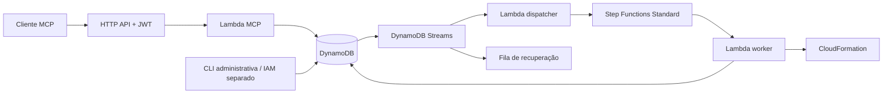

# Cloud Architect MCP

Servidor MCP stateless para gerar planos AWS revisáveis e provisionar recursos após aprovação administrativa. Implementado em TypeScript, com o SDK oficial MCP v2 e protocolo **2026-07-28**.

O projeto tem um modo local executável sem conta AWS e infraestrutura CDK para a execução real. O modo local **simula** o provisionamento: nenhum recurso de nuvem é criado.

## O que este MVP faz

| Ferramenta MCP       | Resultado                                                                | Escopo JWT           |
| -------------------- | ------------------------------------------------------------------------ | -------------------- |
| `list_blueprints`    | Catálogo de arquiteturas suportadas                                      | `architecture:read`  |
| `plan_architecture`  | Template CloudFormation, resumo, proprietário, validade e digest SHA-256 | `architecture:plan`  |
| `apply_architecture` | Operação persistida para um plano aprovado                               | `architecture:apply` |
| `get_operation`      | Estado, resultado e identificadores da implantação                       | `architecture:read`  |

Blueprints disponíveis:

- **storage:** bucket S3 privado, criptografado e versionado.
- **event-backbone:** fila SQS, dead-letter queue e tabela DynamoDB sob demanda, com PITR. A aplicação consumidora dos eventos deve ser implementada separadamente.

Os recursos são retidos na remoção da stack. Isso preserva dados e também pode manter custos. O MVP cria novas stacks; atualização, exclusão, estimativa de custos, código arbitrário e templates enviados pelo cliente não fazem parte deste recorte.

O modelo de linguagem fica no cliente MCP: ele escolhe o blueprint e preenche parâmetros estruturados. O servidor não precisa de uma chave de API de LLM e não transforma texto livre em infraestrutura irrestrita.

## Executar localmente

Requisito: **Node.js 24.x**, incluindo o módulo `node:sqlite`.

```sh
npm ci
npm run check
npm run demo
npm run dev
```

O servidor escuta exclusivamente em `http://127.0.0.1:8787/mcp`. O banco SQLite fica em `.local/architect.db`, fora do Git. O perfil local representa um único desenvolvedor confiável, sem autenticação, e deve permanecer em loopback.

`npm run demo` executa cliente e servidor oficiais MCP v2 no mesmo processo: gera o plano, verifica a recusa sem aprovação, simula a aprovação administrativa, aplica, consulta e repete a operação. A aprovação automática desse exemplo existe apenas em um banco efêmero de demonstração.

Em outro terminal, com `npm run dev` aberto:

```sh
npm run client -- --tool list_blueprints
npm run client -- --tool plan_architecture --input examples/plan-storage.json
```

Revise o template retornado. Use o `id` e o `digest` completos no comando administrativo:

```sh
npm run inspect -- --plan <planId>
npm run approve -- --plan <planId> --digest <sha256>
```

Copie `examples/apply.json` e preencha `planId`, `digest` e uma chave de idempotência própria. Depois:

```sh
npm run client -- --tool apply_architecture --input <seu-arquivo.json>
npm run inspect -- --operation <operationId>
```

O simulador local retoma operações pendentes após reinício. O resultado inclui `mode: SIMULATED`. Planos expiram em 24 horas; a repetição de uma operação já aceita continua retornando a mesma operação após a expiração.

## Arquitetura AWS



A aprovação é vinculada ao digest do template. A operação e a mudança de estado do plano são gravadas na mesma transação. O registro da operação funciona como uma saída persistida: o stream dispara a execução mesmo que a conexão MCP termine. O nome determinístico da execução e o token CloudFormation permitem recuperar repetições.

O transporte não preserva sessão MCP. O estado de negócio permanece no banco e no workflow. A consulta usa `get_operation`; este MVP não implementa a extensão MCP Tasks nem subscriptions/SSE. Clientes precisam suportar a revisão 2026-07-28; o modo legado é rejeitado explicitamente.

## Infraestrutura e validação

```sh
npm run synth
```

Esse comando gera os bundles e o CloudFormation da infraestrutura em `cdk.out/`. A síntese não implanta nada. Os valores JWT de exemplo servem apenas à inspeção local; configure emissor e audiência reais antes de implantar.

Consulte [o guia de implantação](docs/deployment.md), [as decisões e fronteiras de confiança](docs/architecture.md) e [as evidências de validação](docs/validation.md).

```sh
npm run typecheck
npm test
npm run format:check
npm audit --omit=dev
```

A CI executa verificação de tipos, testes, build, formatação, síntese e auditoria de dependências. Testes com clientes MCP e SQLite são reais; os adaptadores AWS são exercitados com respostas controladas do SDK. Uma implantação sandbox continua necessária para validar IAM, authorizer, streams e provisionamento no serviço AWS real.

## Estrutura

```text
src/domain/       Contratos, schemas, catálogo e invariantes
src/adapters/     Persistência em memória, SQLite e DynamoDB
src/mcp.ts        Ferramentas MCP
src/http.ts       Limites HTTP, origem e metadados de autorização
src/lambda.ts     Adapter API Gateway
src/dispatcher.ts Entrega das operações à Step Functions
src/worker.ts     Criação e acompanhamento CloudFormation
src/cli/          Inspeção e aprovação administrativa
infra/            Infraestrutura CDK
tests/            Domínio, protocolo, persistência e infraestrutura
examples/         Entradas sem segredos
```

## Referências

- [Especificação MCP 2026-07-28](https://modelcontextprotocol.io/specification/2026-07-28/changelog)
- [SDK TypeScript oficial](https://github.com/modelcontextprotocol/typescript-sdk)
- [Transações DynamoDB e IAM](https://docs.aws.amazon.com/amazondynamodb/latest/developerguide/transaction-apis.html)
- [Step Functions Standard](https://docs.aws.amazon.com/step-functions/latest/dg/choosing-workflow-type.html)
- [CloudFormation CreateStack](https://docs.aws.amazon.com/AWSCloudFormation/latest/APIReference/API_CreateStack.html)
