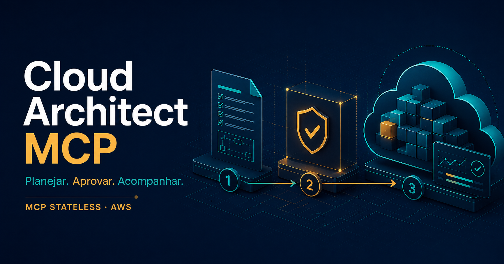

# MCP stateless na AWS: como estou construindo infraestrutura com IA, aprovação e rastreabilidade

Uma ideia que eu queria tirar do papel era usar uma AWS Lambda como servidor MCP para transformar pedidos de um agente de IA em propostas de arquitetura de nuvem.

A mudança para um protocolo sem sessão tornou essa implementação mais direta. Mas a parte mais interessante apareceu depois: como permitir que o agente ajude a montar infraestrutura e, ao mesmo tempo, manter controle sobre o que será executado?

Foi com essa pergunta que desenvolvi o **Cloud Architect MCP**, um projeto em TypeScript com código disponível no GitHub e licença Apache 2.0.

## O que mudou com o MCP stateless

A revisão de 28 de julho de 2026 removeu as sessões no nível do protocolo e o handshake obrigatório de inicialização. Cada requisição passa a carregar os metadados necessários. Isso facilita executar chamadas independentes em uma arquitetura serverless. Os detalhes estão na [especificação oficial do MCP](https://modelcontextprotocol.io/specification/2026-07-28/changelog).

O trabalho de negócio, porém, continua tendo estado: existe um plano, alguém o aprova, uma operação começa e seu resultado precisa ser consultado depois. No projeto, essas informações ficam na persistência e na orquestração, com identificadores explícitos.

Assim, encerrar uma conversa ou trocar a instância que atende a chamada não deve apagar o andamento de uma operação já aceita.

## Como a ferramenta funciona

Imagine o pedido: “Preciso de armazenamento privado e versionado para os documentos de um projeto”.

O agente consulta o catálogo e escolhe um blueprint. O servidor recebe parâmetros estruturados e gera um template CloudFormation, com resumo, proprietário, validade e um digest SHA-256 que identifica seu conteúdo.

Antes de qualquer provisionamento, um operador pode recuperar a proposta, comparar alternativas e revisar os recursos. A aprovação acontece por um comando administrativo separado do MCP e fica vinculada ao digest do plano.

Só depois o agente pode solicitar a aplicação. O desenho AWS usa API Gateway, Lambda, DynamoDB, DynamoDB Streams, Step Functions e CloudFormation para persistir e acompanhar a execução. Repetir um pedido com a mesma chave de idempotência retorna a mesma operação.

O fluxo é:

**Planejar → revisar → aprovar → aplicar → acompanhar.**

O modelo de linguagem fica no cliente MCP. O servidor trabalha com blueprints conhecidos e parâmetros validados, sem precisar receber código arbitrário nem manter uma chave de API de LLM.

## O que evoluiu na versão 0.3

A versão mais recente acrescenta três capacidades que tornam o uso mais prático.

**Histórico paginado.** Planos e operações podem ser encontrados novamente sem guardar manualmente cada identificador. As consultas respeitam o proprietário autenticado.

**Comparação de planos.** A ferramenta distingue alterações na definição da arquitetura de nomes gerados automaticamente. Isso importa porque duas propostas equivalentes ainda podem criar stacks diferentes se ambas forem aplicadas.

**Tratamento de resultados incertos.** Um timeout do workflow não prova que a CloudFormation parou. A operação pode passar a `NEEDS_ATTENTION`, permitindo consultar o estado real antes de registrar um resultado definitivo. A reconciliação foi implementada sem permissão de criar recursos.

Essa última mudança veio da auditoria do próprio projeto: uma automação precisa representar a incerteza, especialmente quando uma solicitação pode ter sido aceita por um serviço antes de uma resposta se perder.

## Onde vejo aplicações

Hoje existem dois blueprints: armazenamento S3 privado, criptografado e versionado; e uma base de eventos com SQS, fila de mensagens não processadas e DynamoDB.

Esses componentes podem apoiar projetos internos, armazenamento de documentos e preparação de infraestrutura para aplicações orientadas a eventos. Também servem como base de estudo para equipes interessadas em integrar agentes de IA a catálogos de infraestrutura com revisão humana.

A oportunidade que quero explorar é adaptar esse fluxo a necessidades reais de empresas: blueprints próprios, políticas de aprovação e integração com seus processos de plataforma e operações.

## O estágio atual, com transparência

O projeto inclui execução local, cliente MCP oficial, persistência SQLite, testes automatizados, pipeline de CI e síntese da infraestrutura CDK. O modo local **simula** o provisionamento e identifica isso no resultado.

A integração com os serviços AWS foi exercitada com respostas controladas do SDK. Ainda é necessário implantar e validar em uma conta sandbox para testar IAM, autenticação, streams, eventos e provisionamento reais.

Também não há, nesta versão, atualização ou exclusão de stacks, estimativa de custos ou suporte a múltiplas nuvens. As aplicações que produzem e consomem eventos continuam sendo uma implementação separada.

Esse recorte permite discutir o projeto a partir do que está implementado e verificável.

## Código, explicação e próximos passos

O repositório reúne código, exemplos, testes e instruções de execução:

[Acessar Cloud Architect MCP no GitHub](https://github.com/pedropaulofernandes88-stack/cloud-architect-mcp)

Para entender o fluxo e as aplicações em linguagem simples, comece pelo [guia de uso](https://github.com/pedropaulofernandes88-stack/cloud-architect-mcp/blob/main/docs/usage.md). As [evidências de validação](https://github.com/pedropaulofernandes88-stack/cloud-architect-mcp/blob/main/docs/validation.md) registram os testes realizados e seus limites.

Se você trabalha com plataforma, DevOps ou arquitetura de nuvem, gostaria de ouvir: em qual etapa sua equipe mais precisa de controle ao conectar agentes à infraestrutura?

Também tenho interesse em conversar sobre pilotos para adaptar e validar esse fluxo em ambientes empresariais.

#MCP #AWS #Serverless #InteligenciaArtificial #DevOps #CloudComputing
